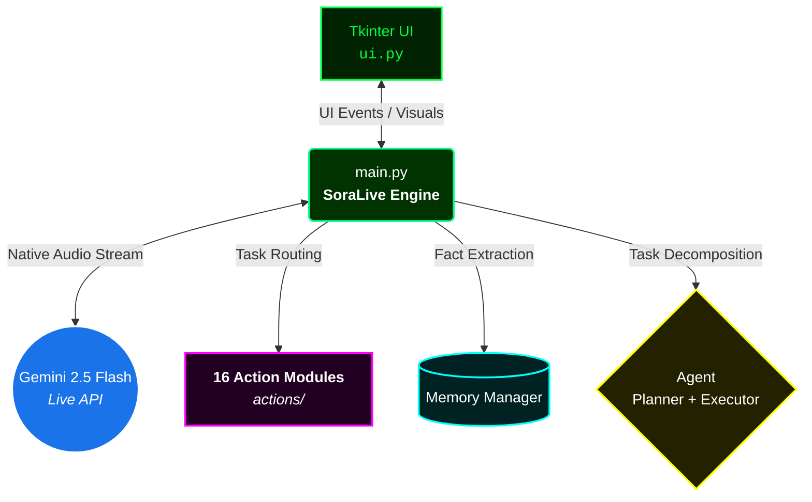

<div align="center">
    <!-- Beautiful Header Image using Capsule Render -->
    

<p align="center">
  <a href="https://github.com/akashvoffi-design/SORA-AI-agent-"></a>
  
  
  
  
</p>

### A next-generation, real-time voice AI assistant that can **hear**, **see**, **understand**, and **control** your entire Windows computer — all running locally with zero subscriptions.

<p align="center">
  <a href="#-quick-start"><b>Quick Start</b></a> •
  <a href="#-features"><b>Features</b></a> •
  <a href="#%EF%B8%8F-architecture"><b>Architecture</b></a> •
  <a href="#-project-structure"><b>Project Structure</b></a> •
  <a href="#-tech-stack"><b>Tech Stack</b></a> •
  <a href="#-how-it-works"><b>How It Works</b></a> •
  <a href="#-license"><b>License</b></a>
</p>

</div>

---

## ✨ Overview

**SORA** is an advanced, voice-driven AI assistant that transforms your Windows PC into a fully interactive intelligent system.

Speak naturally — it listens in real-time, understands your intent, responds with a human-like voice, and executes tasks across your entire system autonomously. Powered by Google's **Gemini 2.5 Flash** model with native audio streaming, it delivers sub-second response times with full tool-calling capabilities.

<br>

<div align="center">
  <table>
    <tr>
      <th align="center">Traditional Assistants</th>
      <th align="center">SORA </th>
    </tr>
    <tr>
      <td>☁️ Cloud-only, subscription-locked</td>
      <td>💻 Free Gemini API (local execution)</td>
    </tr>
    <tr>
      <td>🗣️ Limited to voice Q&A</td>
      <td>⚙️ Full system control + automation</td>
    </tr>
    <tr>
      <td>🙈 No screen/camera awareness</td>
      <td>👁️ Real-time visual understanding</td>
    </tr>
    <tr>
      <td>🧠 Forgets you every session</td>
      <td>🧩 Persistent memory across sessions</td>
    </tr>
    <tr>
      <td>🚶 Single-step commands only</td>
      <td>🏃 Multi-step autonomous task planning</td>
    </tr>
  </table>
</div>

<br>

## 🚀 Features

### 🎙️ Real-Time Voice Interaction
- ⚡ **Native audio streaming** via Gemini 2.5 Flash Live API
- 🔊 Bidirectional audio — speak and hear simultaneously
- 📝 Automatic input/output transcription with conversation logging
- 🌍 Responds in the **same language you speak** (multilingual support)

### 🖥️ Full System Control
- 🚀 **App Launcher** — Open any application by name (`"Open Spotify"`, `"Launch VS Code"`)
- ⚙️ **Computer Settings** — Volume, brightness, WiFi, dark mode, zoom, minimize/maximize, screenshots, lock, restart, shutdown
- ⌨️ **CMD Control** — Execute terminal commands via natural language (`"Find the 10 largest files on C drive"`)
- 🗂️ **Desktop Management** — Change wallpaper, organize files by type/date, clean desktop
- 📁 **File Controller** — Create, read, edit, move, copy, delete files; find files by name/extension; disk usage analysis

### 🌐 Web & Browser Automation
- 🔍 **Web Search** — Real-time information retrieval via DuckDuckGo with comparison mode
- 🕸️ **Browser Control** — Navigate URLs, search, click elements, fill forms, scroll, extract text (Playwright-powered)
- 📺 **YouTube Integration** — Play videos, summarize transcripts, get video info, browse trending
- ✈️ **Flight Finder** — Search Google Flights for the best deals with multi-leg support

### 👁️ Visual Awareness
- 📸 **Screen Analysis** — Capture and analyze what's on your display in real-time
- 🎥 **Webcam Understanding** — Camera-based visual processing for questions about your environment
- 🧠 Powered by Gemini's multimodal vision capabilities

### 🧩 Persistent Memory
- 👤 **Learns about you** — Automatically extracts and stores personal facts (name, city, hobbies, preferences)
- ⚡ **Two-stage memory pipeline** — Quick YES/NO relevance check → full extraction (80% fewer API calls)
- 💾 **Cross-session persistence** — Stored as JSON, survives restarts
- 💉 Memory injected into system prompt for personalized responses

### 💬 Messaging & Reminders
- 📱 **Send Messages** — WhatsApp, Telegram, and other platforms via automation
- ⏰ **Smart Reminders** — Set timed reminders using Windows Task Scheduler with natural language (`"Remind me in 30 minutes"`)

### 💻 Code & Development
- 👨‍💻 **Code Helper** — Write, edit, explain, run, or auto-build code files in any language
- 🏗️ **Dev Agent** — Scaffold entire multi-file projects, install dependencies, open VS Code, run & auto-fix errors
- 🖱️ **Computer Control** — Direct mouse/keyboard automation, screen element finding, form filling with random/real data

### 🤖 Autonomous Task Agent
- 📝 **Multi-step task planner** — Breaks complex goals into tool-call sequences automatically
- 🚦 **Priority queue** — Low / Normal / High task prioritization
- 🔄 **Error recovery** — Automatic replanning on step failure with fallback strategies
- 🔈 **Progress reporting** — Speaks updates as tasks progress

<br>

## ⚡ Quick Start

### Prerequisites

| Requirement | Details |
|---|---|
| **OS** | Windows 10 / 11 🪟 |
| **Python** | 3.10 or newer 🐍 |
| **Hardware** | Microphone (required) 🎤, Webcam (optional) 📷 |
| **API Key** | Free [Gemini API Key](https://aistudio.google.com/apikey) 🔑 |

### Installation

```bash
# 1. Clone the repository
git clone https://github.com/akashvoffi-design/SORA-AI-agent-.git
cd SORA-AI-agent-

# 2. Run the automated setup (installs all dependencies + Playwright browsers)
python setup.py

# 3. Launch SORA
python main.py
```

> **💡 Tip (First Launch):** The UI will prompt you to enter your **Gemini API key**. Paste it in, click **"INITIALISE SYSTEMS"**, and SORA will come online.
> 
> *The Gemini API free tier provides generous daily limits. For higher throughput, you can upgrade via Google AI Studio.*

<br>

## 🏗️ Architecture



### Data Flow

1. 🎤 **Microphone → PyAudio** captures 16kHz PCM audio in real-time.
2. ☁️ **Audio chunks → Gemini Live API** via WebSocket streaming.
3. 🧠 **Gemini processes** speech and returns tool calls or audio responses.
4. 🔀 **Tool Router** dispatches to the appropriate action module.
5. 🔄 **Action results** are fed back to Gemini for the spoken response.
6. 🔊 **24kHz audio output** is played back through the speakers.
7. 🕵️ **Memory updater** periodically extracts personal facts in the background.

<br>

## 📂 Project Structure

```text
SORA/
├── 🎯 main.py                     # Entry point — SoraLive engine, tool routing, audio pipeline
├── 🖥️ ui.py                       # Tkinter UI — Green HUD display, animated face, waveform, log panel
├── ⚙️ setup.py                    # One-click installer — pip + Playwright browsers
├── 📦 requirements.txt            # Python dependencies (19 packages)
├── 📖 README.md                   # This documentation file
│
├── 🧠 core/
│   └── prompt.txt              # System prompt — personality, rules, tool selection logic
│
├── 🔑 config/
│   └── api_keys.json           # Gemini API key (auto-created on first launch)
│
├── 💭 memory/
│   ├── memory_manager.py       # Load/save/update persistent memory (JSON-based)
│   └── long_term.json          # User memory store (auto-created)
│
├── 🤖 agent/
│   ├── planner.py              # AI-powered task decomposition (Gemini 2.5 Flash Lite)
│   ├── executor.py             # Step-by-step execution engine with error recovery
│   ├── task_queue.py           # Priority queue for async multi-step tasks
│   └── error_handler.py        # Smart error classification and retry logic
│
└── 🛠️ actions/                    # 16 independent action modules
    ├── open_app.py             # Launch any Windows application
    ├── web_search.py           # DuckDuckGo search with comparison mode
    ├── weather_report.py       # Real-time weather via API
    ├── send_message.py         # WhatsApp/Telegram messaging automation
    ├── reminder.py             # Windows Task Scheduler reminders
    ├── youtube_video.py        # Play, summarize, trending, video info
    ├── screen_processor.py     # Screen capture + Gemini vision analysis
    ├── computer_settings.py    # Volume, brightness, display, system controls
    ├── browser_control.py      # Playwright-powered web automation
    ├── file_controller.py      # File/folder CRUD, search, disk analysis
    ├── cmd_control.py          # Natural language → CMD commands
    ├── desktop.py              # Wallpaper, organize, clean desktop
    ├── code_helper.py          # Write, edit, run, explain code
    ├── dev_agent.py            # Multi-file project scaffolding
    ├── computer_control.py     # Direct mouse/keyboard/screen automation
    └── flight_finder.py        # Google Flights search automation
```

<br>

## 🛠 Tech Stack

<details>
<summary><b>View Detailed Tech Stack</b></summary>

| Component | Technology | Purpose |
|---|---|---|
| **AI Model** | Gemini 2.5 Flash (Native Audio) | Real-time voice understanding, tool calling, responses |
| **Memory Model** | Gemini 2.5 Flash Lite | Low-cost personal fact extraction |
| **Planning Model** | Gemini 2.5 Flash Lite | Multi-step task decomposition |
| **Audio** | PyAudio | Microphone capture (16kHz) and speaker playback (24kHz) |
| **UI Framework** | Tkinter + Pillow | Animated green HUD with face rendering |
| **Browser Automation** | Playwright | Click, type, navigate, scrape web content |
| **Desktop Automation** | PyAutoGUI + pyperclip | Mouse/keyboard control, clipboard operations |
| **Screen Capture** | MSS + OpenCV + NumPy | Fast screen/webcam capture and processing |
| **Search Engine** | DuckDuckGo Search API | Private web search without API keys |
| **Video Transcripts** | youtube-transcript-api | YouTube video summarization |
| **System Control** | PyCaw + comtypes | Windows audio/volume control |
| **Process Management** | psutil | System process monitoring and control |
| **File Management** | send2trash | Safe file deletion to recycle bin |
| **Notifications** | win10toast | Windows toast notifications for reminders |
| **HTTP Client** | Requests + BeautifulSoup4 | Web scraping and API communication |

</details>

<br>

## ⚙️ How It Works

### Voice Pipeline

The system uses Google's **Gemini 2.5 Flash Native Audio** model in **Live** mode, establishing a persistent WebSocket connection for bidirectional audio streaming. This enables true real-time conversation with sub-second latency.

### Memory Pipeline

Every 5 conversational turns, the system runs a two-stage memory check:

1. **Stage 1 (Quick Check)**: Asks Gemini Flash Lite if the user's message contains personal facts → ~5 tokens
2. **Stage 2 (Extraction)**: If YES, extracts structured facts into JSON → stored in `long_term.json`

This achieves **~80% fewer API calls** compared to checking every turn.

### Task Planning

For complex multi-step requests (e.g., *"Research quantum computing and save a report to my desktop"*):

1. **Planner** 🧠 decomposes the goal into ≤5 tool-call steps.
2. **Executor** 🏃 runs each step sequentially, collecting results.
3. **Error Handler** 🛡️ classifies failures and triggers automatic **replanning** if needed.
4. **Progress** 🎤 is spoken aloud via the live audio session.

<br>

## 🖼️ The UI

SORA features a custom-built **Green HUD** interface inspired by hacker/cyberpunk aesthetics:

- **Animated face display** with dynamic scaling and pulsing green halos.
- **Rotating arc rings** and scanning sweeps that accelerate during speech.
- **HUD side panels** — System status, scan progress, signal analysis, decrypt display, clock, audio waveform.
- **Scanline overlay** for that authentic CRT/terminal feel.
- **Audio waveform visualizer** — reacts in real-time to voice activity.
- **Status indicators** — `INITIALISING` → `ONLINE` → `SPEAKING` → `PROCESSING`
- **Conversation log panel** — with character-by-character typewriter effect.

<br>

## 🗣️ Example Commands

| What You Say | What Happens |
|---|---|
| <kbd>"Open Chrome"</kbd> | Launches Google Chrome |
| <kbd>"What's the weather in Tokyo?"</kbd> | Fetches and speaks live weather data |
| <kbd>"Set a reminder for 3 PM"</kbd> | Creates a Windows scheduled task |
| <kbd>"Search for the latest AI news"</kbd> | Runs a DuckDuckGo search and summarizes |
| <kbd>"Play lofi hip hop on YouTube"</kbd> | Opens YouTube and plays the video |
| <kbd>"What's on my screen right now?"</kbd> | Captures screen and analyzes with vision |
| <kbd>"Send a message to John"</kbd> | Automates WhatsApp message |
| <kbd>"Find flights to London next Friday"</kbd> | Searches Google Flights |
| <kbd>"Write a Python script that sorts a list"</kbd> | Generates, saves, and optionally runs code |
| <kbd>"Set volume to 50%"</kbd> | Adjusts system volume |
| <kbd>"Organize my desktop by file type"</kbd> | Sorts desktop files into categorized folders |

<br>

## 📜 License

This project is licensed under the **Creative Commons Attribution-NonCommercial 4.0 International License (CC BY-NC 4.0)**.

- ✅ Personal use & Educational use
- ✅ Modification with attribution
- ❌ Commercial use & Redistribution for profit

---

<p align="center">
  
</p>
<p align="center">
  <sub>If you found this project useful, ⭐ star the repository to show your support!</sub>
</p>
